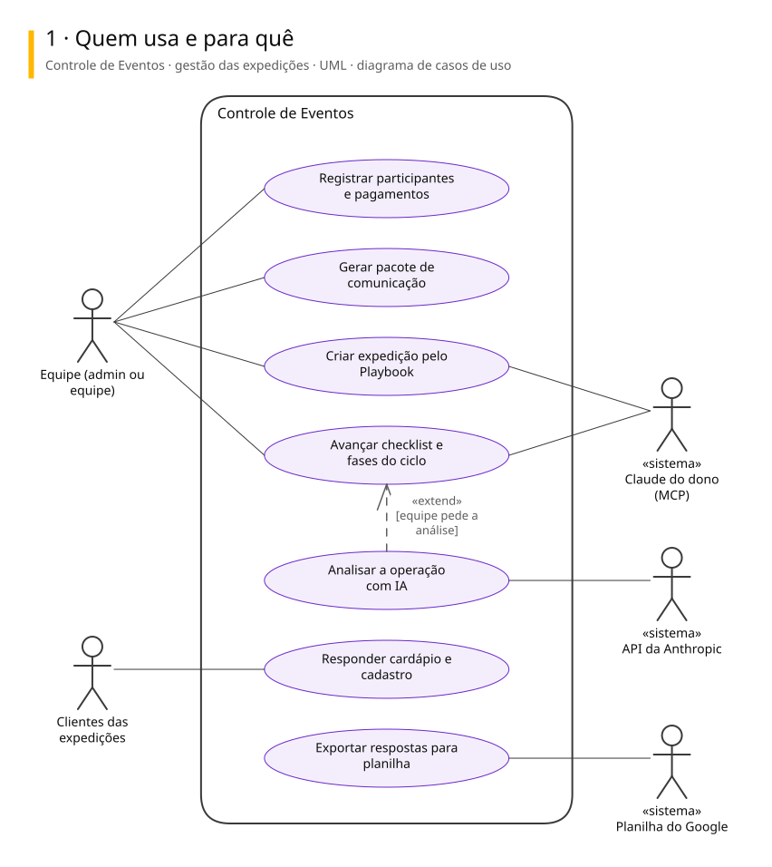
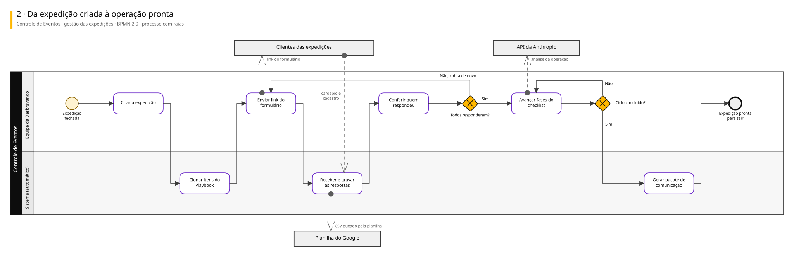
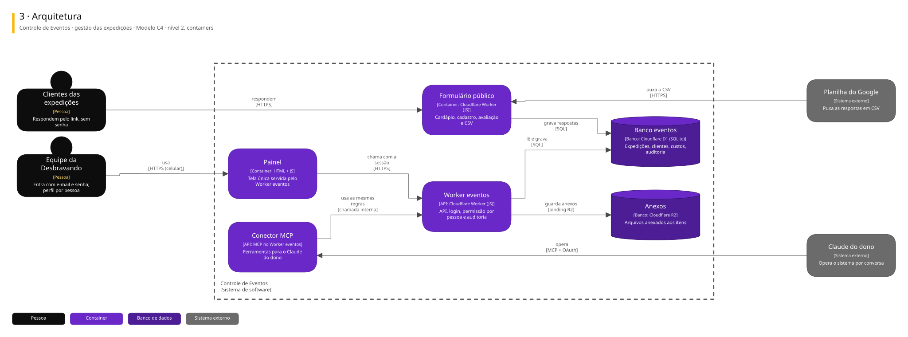

# Arquitetura

Três vistas do sistema, cada uma numa notação padrão.

| Vista | Notação | Responde |
|---|---|---|
| Casos de uso | UML | Quem usa e para quê |
| Processo | BPMN 2.0 | Como o trabalho anda, com uma raia para cada quem executa |
| Arquitetura | C4, nível 2 | De que partes o sistema é feito e com quem conversa |

## Controle de Eventos · gestão das expedições

Sistema em produção que a equipe da Desbravando UTV usa no celular, em campo: checklist, ciclo operacional, participantes, financeiro, hospedagem e formulários públicos. O Claude do dono opera o mesmo sistema pelo conector MCP.

### Quem usa e para quê

### Da expedição criada à operação pronta

### Arquitetura

Para editar: [controle-de-eventos.excalidraw](./controle-de-eventos.excalidraw), que abre em [excalidraw.com](https://excalidraw.com) ou na extensão Excalidraw do VS Code.

## De onde vêm

Os diagramas são gerados a partir do Sinapse, o vault onde o Pedro organiza notas e projetos. Mudança feita direto aqui some na próxima publicação: o lugar de mudar é a especificação no Sinapse.
